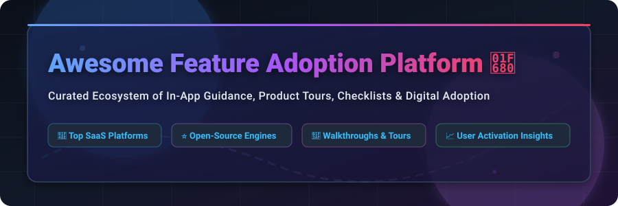

# 🚀 Awesome Feature Adoption Platform Ecosystem

<p align="center">
  <a href="https://github.com/ishandutta2007/Awesome-Awesome-Awesome"></a>
  <a href="https://discord.gg/jc4xtF58Ve"></a>
  <a href="LICENSE"></a>
  <a href="https://github.com/ishandutta2007/Awesome-Feature-Adoption-Platform/pulls"></a>
  <a href="https://github.com/ishandutta2007"></a>
</p>

<p align="center">
  
</p>

---

## 📌 Ecosystem Overview & SEO Guide

**Curated List of SaaS Digital Adoption Platforms (DAP) & Open-Source Guided Tour Engines**

*Focused on In-App Guidance, Interactive Product Tours, Onboarding Checklists, Tooltips, User Activation & Product-Led Growth (PLG)*

Welcome to the definitive awesome list for **Feature Adoption Platforms**, **Digital Adoption Platforms (DAPs)**, and **In-App User Onboarding Software**. Whether you are a product manager seeking enterprise no-code tour builders or a developer looking for open-source JavaScript walkthrough libraries, this repository indexes the best-in-class solutions to boost user retention, streamline feature discovery, and maximize SaaS product activation.

---

## 📑 Table of Contents

- [📊 Sector Market Size & Dynamics](#-sector-market-size--dynamics)
- [🏢 SaaS & Commercial Digital Adoption Platforms](#-saas--commercial-digital-adoption-platforms)
- [⭐ Open-Source Guided Tour & Onboarding Engines](#-open-source-guided-tour--onboarding-engines)
- [🛠 Architectural Guidance & Integration Patterns](#-architectural-guidance--integration-patterns)
- [🤝 How to Contribute](#-how-to-contribute)
- [💖 Support & Sponsorship](#-support--sponsorship)
- [📈 Star History](#-star-history)
- [⚖️ Disclaimer & License](#%EF%B8%8F-disclaimer--license)

---

## 📊 Sector Market Size & Dynamics

> 💡 **Industry Insights (2026)**: The global **Digital Adoption Platform (DAP)** market is estimated at **$2.8 Billion in 2026** and projected to reach **$6.5 Billion by 2030** (expanding at a ~17.4% CAGR). The sector is **moderately fragmented**: complex enterprise multi-application adoption is led by consolidated giants (Pendo, WalkMe/SAP), while product-led growth (PLG) and mid-market SaaS onboarding remain heavily split among agile no-code platforms (Appcues, Userpilot, Chameleon, Userflow, UserGuiding).

---

## 🏢 SaaS & Commercial Digital Adoption Platforms

*The following table lists top commercial feature adoption platforms, sorted by estimated company scale (valuation and annual recurring revenue) in descending order.*

| 🏢 Platform | 📊 Company Size / Scale (Valuation / ARR) | 💰 Starting Price | 🎁 Free Tier / Trial Limits | ✨ Core Highlights & Best For |
| :--- | :--- | :--- | :--- | :--- |
| **[Pendo](https://www.pendo.io/)** | **$2.6B Valuation** / ~$200M ARR | **$583/mo** ($7,000/yr entry est.) | **Free Plan ($0)**: Permanent free tier up to **500 MAUs** with core product analytics & guides. | Combines enterprise product analytics with in-app walkthroughs, NPS surveys, and user feedback loops. |
| **[WalkMe](https://www.walkme.com/)** | **$1.5B Valuation** (SAP) / ~$267M ARR | **$750/mo** ($9,000/yr entry est.) | **14-Day Free Trial**: Available upon request (plus WalkMe Mobile free tier). | Enterprise-grade digital adoption across multi-app employee & customer workflows. |
| **[Gainsight PX](https://www.gainsight.com/product-experience/)** | **$1.1B Parent Valuation** / ~$30M ARR | **$500/mo** ($6,000/yr entry est.) | **14-Day Free Trial**: Full evaluation of product analytics & targeted engagement. | Purpose-built for Customer Success & Product teams to drive product adoption & retention. |
| **[Whatfix](https://www.whatfix.com/)** | **$900M Valuation** / ~$58M ARR | **$1,000/mo** ($12,000/yr entry est.) | **14-Day Free Trial**: Demo & trial environment available on request. | In-app guidance, interactive walkthroughs, and automated task execution for SaaS applications. |
| **[Appcues](https://www.appcues.com/)** | **~$25.5M ARR** / $52.8M Funding | **$249/mo** (Essential, annual) | **14-Day Free Trial**: Full-featured access, no credit card required. | Pioneer in no-code onboarding flows, slideout modals, and user activation checklists. |
| **[Chameleon](https://www.chameleon.io/)** | **~$12.2M ARR** / $13M Funding | **$279/mo** (Startup, 2k MTUs) | **14-Day Free Trial**: Full access to tours, launchers, tooltips & microsurveys. | Deeply customizable product adoption toolkit designed for product-led growth (PLG) teams. |
| **[Userpilot](https://userpilot.com/)** | **~$9.5M ARR** / $6M Funding | **$299/mo** (Starter, 2k MAUs) | **14-Day Free Trial**: Full access to flow builder, checklists, and product analytics. | No-code product onboarding, in-app triggers, user segmentation, and feature heatmaps. |
| **[Userflow](https://userflow.com/)** | **~$8.0M ARR** / Bootstrapped | **$240/mo** (Startup, annual) | **14-Day Free Trial**: Complete platform access including resource centers & flows. | Ultra-fast no-code builder for interactive tours, checklists, and automated onboarding. |
| **[UserGuiding](https://userguiding.com/)** | **~$5.0M ARR** / $1.5M Funding | **$174/mo** (Starter, 2.5k MAUs) | **14-Day Free Trial**: Access to interactive walkthroughs, banners, and checklists. | High-value, budget-friendly onboarding builder tailored for growing startups & SaaS tools. |
| **[Inline Manual](https://inlinemanual.com/)** | **~$4.0M ARR** | **$158/mo** (Standard, 250 MAUs) | **14-Day Free Trial**: Unlimited guide creation during evaluation period. | Flexible digital adoption platform for interactive walkthroughs and customer support tooltips. |
| **[Apty](https://www.apty.ai/)** | **~$4.0M ARR** / $7.5M Funding | **$833/mo** ($10,000/yr entry est.) | **14-Day Free Trial**: Trial environment for web & enterprise app workflows. | Business process compliance & step-by-step guidance for enterprise SaaS applications. |
| **[CommandBar](https://www.commandbar.com/)** | **~$3.0M ARR** / $4.8M Funding | **$0/mo** (Community Free Plan) | **Free Plan ($0)**: Permanent free tier up to **1,000 MAUs** (Paid tiers start at $249/mo). | AI-assisted command palette, in-app search, Nudge tours, and HelpHub assistance. |
| **[Product Fruits](https://productfruits.com/)** | **~$3.0M ARR** / Bootstrapped | **$96/mo** (Growing, annual) | **14-Day Free Trial**: Full feature sandbox including tours, hints & feedback widgets. | Lightweight, complete product adoption suite with tours, checklists, and hints. |

---

## ⭐ Open-Source Guided Tour & Onboarding Engines

*The following list features top open-source projects for building custom in-app tours, highlights, and onboarding flows, sorted by GitHub Stars_Count in descending order.*

- **[Driver.js](https://github.com/kamranahmedse/driver.js)**  
  [](https://github.com/kamranahmedse/driver.js/stargazers)  
  *Lightweight, vanilla JavaScript driver engine to highlight elements, create popovers, and build interactive product walkthroughs with zero dependencies.*

- **[Intro.js](https://github.com/usablica/intro.js)**  
  [](https://github.com/usablica/intro.js/stargazers)  
  *Established open-source step-by-step guide and feature introduction library for web applications.*

- **[Shepherd](https://github.com/shipshapecode/shepherd)**  
  [](https://github.com/shipshapecode/shepherd/stargazers)  
  *Framework-agnostic, production-grade library powered by Floating UI for crafting customizable guided user tours.*

- **[React Joyride](https://github.com/gilbarbara/react-joyride)**  
  [](https://github.com/gilbarbara/react-joyride/stargazers)  
  *Popular React library for creating step-by-step guided tours and highlighting new features in modern web applications.*

- **[Instructions](https://github.com/ephread/Instructions)**  
  [](https://github.com/ephread/Instructions/stargazers)  
  *Customizable coach marks and guided onboarding tour library written in Swift for iOS applications.*

- **[CodeTour](https://github.com/microsoft/codetour)**  
  [](https://github.com/microsoft/codetour/stargazers)  
  *VS Code extension that lets developers record and play back interactive guided tours of codebases.*

- **[Bootstrap Tour](https://github.com/sorich87/bootstrap-tour)**  
  [](https://github.com/sorich87/bootstrap-tour/stargazers)  
  *Quick and easy product tour plugin leveraging Twitter Bootstrap popovers.*

- **[Hopscotch](https://github.com/LinkedInAttic/hopscotch)**  
  [](https://github.com/LinkedInAttic/hopscotch/stargazers)  
  *Framework built by LinkedIn for creating product tours across modern web applications.*

- **[Vue Tour](https://github.com/pulsardev/vue-tour)**  
  [](https://github.com/pulsardev/vue-tour/stargazers)  
  *Lightweight, customizable guided tour plugin designed specifically for Vue.js applications.*

- **[Usertour](https://github.com/usertour/usertour)**  
  [](https://github.com/usertour/usertour/stargazers)  
  *Open-source user onboarding engine (cloud or self-hosted) for building tours, checklists, and in-app surveys.*

- **[Onborda](https://github.com/uixmat/onborda)**  
  [](https://github.com/uixmat/onborda/stargazers)  
  *Modern onboarding flow and product tour library for Next.js, animated smoothly with Framer Motion.*

- **[Tourguide.js](https://github.com/LikaloLLC/tourguide.js)**  
  [](https://github.com/LikaloLLC/tourguide.js/stargazers)  
  *Simple, clean, and lightweight JavaScript library for creating step-by-step guided product tours.*

- **[GuideChimp](https://github.com/Labs64/GuideChimp)**  
  [](https://github.com/Labs64/GuideChimp/stargazers)  
  *Extensible open-source tour engine for building interactive user walkthroughs and onboarding paths.*

- **[Frigade Engage](https://github.com/FrigadeHQ/javascript)**  
  [](https://github.com/FrigadeHQ/javascript/stargazers)  
  *Headless developer platform for building native React onboarding tours, banners, and checklists.*

- **[FeatureDrop](https://github.com/glincker/featuredrop)**  
  [](https://github.com/glincker/featuredrop/stargazers)  
  *Ultra-lightweight open-source product adoption toolkit (< 3 kB core) for changelogs, tours, and checklists.*

---

## 🛠 Architectural Guidance & Integration Patterns

```
   +-----------------------------------------------------------------+
   |                    Front-End Web Application                     |
   |                                                                 |
   |  +------------------------+      +---------------------------+  |
   |  |   Open Tour Library    |      |  Product Analytics SDK    |  |
   |  | (Driver / Shepherd/    |      | (PostHog / Amplitude /    |  |
   |  |   React Joyride)       |      |       Mixpanel)           |  |
   |  +-----------+------------+      +-------------+-------------+  |
   +--------------|---------------------------------|----------------+
                  |                                 |
                  v                                 v
        [ In-App Tour Steps ]             [ Tour Milestone Events ]
                  |                                 |
                  +----------------+----------------+
                                   |
                                   v
                      +--------------------------+
                      |   Application Backend    |
                      |  (Persist User Progress) |
                      +--------------------------+
```

1. **Step 1: Event Instrumentation** — Track core feature clicks and lifecycle milestones using open analytics (PostHog, Segment) or custom APIs.
2. **Step 2: Guidance Injection** — Trigger contextual tooltips and walkthroughs using Shepherd, Driver.js, or React Joyride upon detecting target user cohorts.
3. **Step 3: State Persistence** — Save completed tour steps in user metadata table to avoid repeating flows across devices.
4. **Step 4: Activation Measurement** — Compare feature usage metrics between onboarded user cohorts vs non-onboarded control groups.

---

## 🤝 How to Contribute

Contributions are warmly welcomed! To contribute:

1. Fork the repository on GitHub.
2. Add your SaaS product or Open-Source project to `README.md` following the tabular or star-badged format.
3. Ensure all descriptions are factual, link directly to official sites, and follow existing sorting rules.
4. Submit a Pull Request detailing your additions.

---

## 💖 Support & Sponsorship

If you find this repository helpful for your product team or open-source stack:

- ⭐ **Star this repository** on GitHub to support visibility.
- 🔀 **Fork & share** it with fellow product managers, growth hackers, and engineers.
- ☕ **Sponsor the Maintainer**: Consider buying a coffee or supporting ongoing development via the maintainer's [Sponsor Dashboard](https://github.com/sponsors/ishandutta2007).

---

## 📈 Star History

[](https://star-history.dera.page/#ishandutta2007/Awesome-Feature-Adoption-Platform&type=date&legend=top-left)

---

## ⚖️ Disclaimer & License

- **Disclaimer**: This ecosystem list is community-curated for informational purposes only. In-app guidance engines handle UI interactions and user tracking; proper privacy disclosures and consent regulations (GDPR/CCPA) apply.
- **Awesome Ecosystem**: Part of the [Awesome-Awesome-Awesome](https://github.com/ishandutta2007/Awesome-Awesome-Awesome) curated index.
- **License**: Released under the [MIT License](LICENSE).
